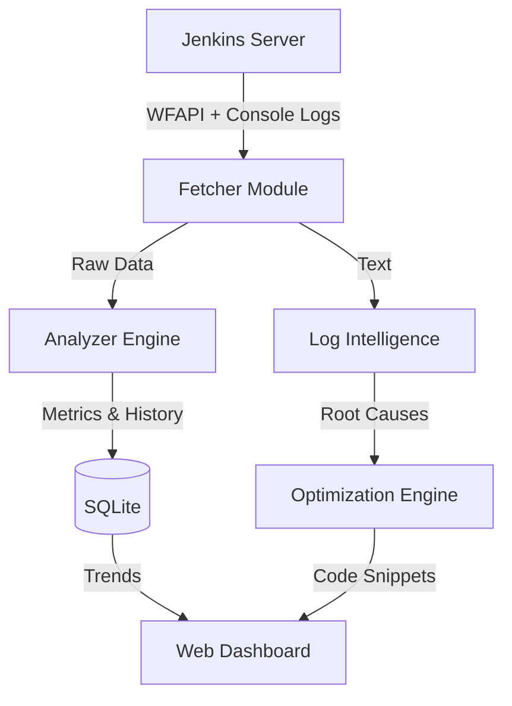

# ⚡ Self-Optimizing CI/CD System v2.0

> An intelligent, autonomous CI/CD observer and optimizer that detects bottlenecks, predicts failures, and generates code-level fixes.

   

## 🚀 Key Features

### 1. **Pipeline Efficiency Score**
Calculates a realtime health score (0-100) for every build based on:
*   **Speed**: Comparisons against historical moving averages.
*   **Reliability**: Failure rates and stability.
*   **Configuration**: Best practice checks (caching, timeouts).

### 2. **Root Cause Analysis (RCA) Engine**
Uses regex-based Log Intelligence to automatically parse console logs and identify:
*   🔴 **Docker Failures** (Daemon connection, missing images)
*   🔴 **Timeouts** (Aborted builds, hung processes)
*   🔴 **Dependency Errors** (NPM/Pip failures, network issues)

### 3. **Auto-Optimization Engine**
The system doesn't just *tell* you what's wrong; it gives you the **Code to Fix It**.
*   Generates `Jenkinsfile` snippets for:
    *   Enabling Docker BuildKit
    *   Adding Stage Parallelism
    *   Implementing Caching Layers
    *   Increasing Timeouts

### 4. **Historical Regression Detection**
*   Tracks every build in a **SQLite Database**.
*   Detects performance regressions (e.g., "Build #45 is 30% slower than average").
*   Visualizes trends using **Chart.js** (Duration vs. Efficiency Score).

---

## 🏗️ Architecture



## 🛠️ Installation & Setup

1.  **Clone the Repository**
    ```bash
    git clone https://github.com/your-repo/cicd-optimizer.git
    cd cicd-optimizer
    ```
2.  **Install Dependencies**
    ```bash
    pip install -r requirements.txt
    ```
3.  **Configure Environment**
    Create a `.env` file or use `app.py` defaults:
    ```env
    JENKINS_URL=http://localhost:8080
    JENKINS_USER=admin
    JENKINS_TOKEN=your_token
    JENKINS_JOB_NAME=test-job
    ```
4.  **Run the System**
    ```bash
    python app.py
    ```
5.  **Access Dashboard**
    Open `http://localhost:5000`

---

## 📂 Project Structure

*   `app.py`: Main Flask application and route controller.
*   `analyzer.py`: **Metric Engine** (Efficiency Score, Regression Logic).
*   `optimizer.py`: **Decision Engine** (Generates Optimization Snippets).
*   `log_parser.py`: **Log Intelligence** (RCA Regex Patterns).
*   `database.py`: **Persistence Layer** (SQLite Handling).
*   `jenkins_fetch.py`: **Integration Layer** (WFAPI + Fallback).

---

## 📸 Screenshots
*(Add screenshots of your Dashboard here)*
