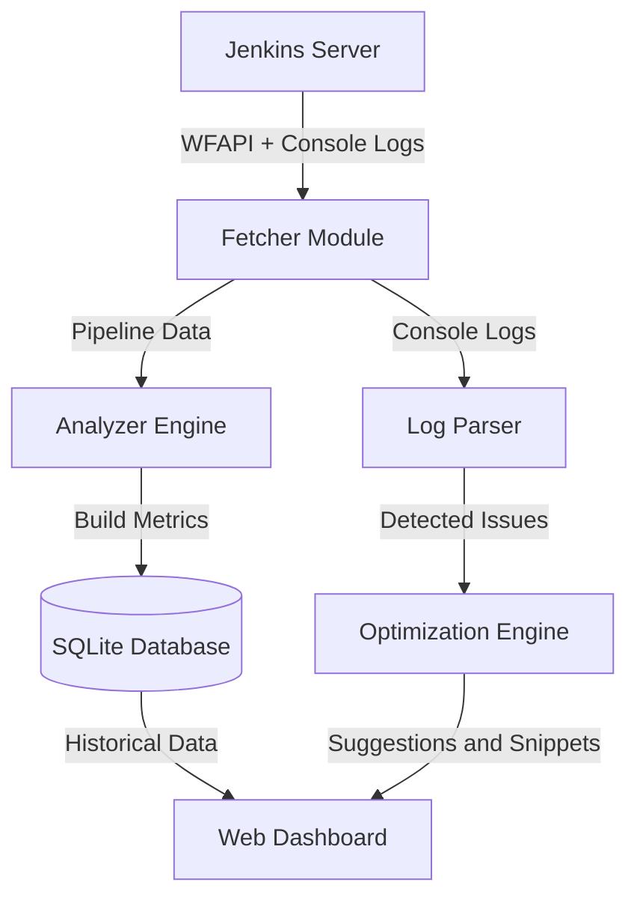

# Self-Optimizing CI/CD System v2.0

A CI/CD monitoring and optimization system built to analyze Jenkins pipelines, identify performance bottlenecks, detect common build failures, and suggest configuration-level improvements.

   

## Key Features

### 1. Pipeline Efficiency Score

Each build is assigned an efficiency score from 0 to 100 based on multiple pipeline metrics.

The score considers:

* **Build Duration** - Compares the current build time with previous builds.
* **Reliability** - Considers build failures and overall pipeline stability.
* **Configuration** - Checks for common pipeline practices such as caching and timeout configuration.

This makes it easier to identify builds that are slower or less reliable than usual.

### 2. Root Cause Analysis

The system analyzes Jenkins console logs using predefined regex patterns to detect common CI/CD failures.

Currently detected issues include:

* **Docker Failures**

  * Docker daemon connection problems
  * Missing images
  * Docker build failures

* **Timeouts**

  * Aborted builds
  * Long-running stages
  * Hung processes

* **Dependency Errors**

  * NPM installation failures
  * Pip installation failures
  * Package and network-related errors

Detected issues are displayed along with the affected build.

### 3. Pipeline Optimization Suggestions

Based on the detected issues and pipeline metrics, the system generates possible Jenkinsfile improvements.

Suggestions can include:

* Enabling Docker BuildKit
* Running independent stages in parallel
* Adding dependency or build caching
* Configuring appropriate stage timeouts

Where applicable, the dashboard also provides Jenkinsfile snippets that can be used as a starting point for the suggested change.

### 4. Historical Regression Detection

Build information is stored in a SQLite database for historical comparison.

The system compares current builds with previous pipeline runs and detects performance regressions.

For example:

> Build #45 took 30% longer than the recent average.

Historical information can be used to track:

* Build duration
* Efficiency score
* Build status
* Performance changes over time

Build trends are displayed on the dashboard using Chart.js.

## Architecture


```mermaid
graph TD
    Jenkins[Jenkins Server] -->|WFAPI + Console Logs| Fetcher[Fetcher Module]

    Fetcher -->|Pipeline Data| Analyzer[Analyzer Engine]
    Fetcher -->|Console Logs| LogEngine[Log Parser]

    LogEngine -->|Detected Issues| Optimizer[Optimization Engine]

    Analyzer -->|Build Metrics| DB[(SQLite Database)]

    DB -->|Historical Data| Dashboard[Web Dashboard]

    Optimizer -->|Suggestions and Snippets| Dashboard
```

### System Flow

```text
Jenkins Pipeline
       |
       v
Jenkins Fetcher
       |
       +------------------+
       |                  |
       v                  v
Pipeline Analyzer      Log Parser
       |                  |
       v                  v
Build Metrics        Detected Issues
       |                  |
       v                  v
SQLite Database     Optimization Engine
       |                  |
       +--------+---------+
                |
                v
          Flask Dashboard
```

## Installation

### 1. Clone the Repository

```bash
git clone https://github.com/your-repo/cicd-optimizer.git
cd cicd-optimizer
```

### 2. Install Dependencies

```bash
pip install -r requirements.txt
```

### 3. Configure Jenkins

Create a `.env` file in the project directory.

```env
JENKINS_URL=http://localhost:8080
JENKINS_USER=admin
JENKINS_TOKEN=your_token
JENKINS_JOB_NAME=test-job
```

The Jenkins API token can be generated from the Jenkins user configuration page.

### 4. Start the Application

```bash
python app.py
```

### 5. Open the Dashboard

Once the application starts, open:

```text
http://localhost:5000
```

## Project Structure

```text
cicd-optimizer/
|
|-- app.py
|-- analyzer.py
|-- optimizer.py
|-- log_parser.py
|-- database.py
|-- jenkins_fetch.py
|-- requirements.txt
|-- templates/
|-- static/
`-- README.md
```

### Main Components

**app.py**

Main Flask application. Handles routes and connects the different modules with the web dashboard.

**analyzer.py**

Processes pipeline metrics and calculates the efficiency score. It also compares current builds with historical data to detect regressions.

**optimizer.py**

Generates optimization suggestions based on pipeline metrics and detected problems.

**log_parser.py**

Parses Jenkins console logs and identifies known failure patterns.

**database.py**

Handles SQLite operations and stores historical build information.

**jenkins_fetch.py**

Communicates with Jenkins to retrieve pipeline information and console logs using Jenkins APIs.

## Technologies Used

| Technology    | Purpose                        |
| ------------- | ------------------------------ |
| Python        | Core application logic         |
| Flask         | Backend and dashboard server   |
| Jenkins       | CI/CD pipeline source          |
| Jenkins WFAPI | Pipeline and stage information |
| SQLite        | Historical build storage       |
| Chart.js      | Build trend visualization      |
| Regex         | Console log analysis           |

## Screenshots

Add screenshots of the dashboard here.

```text
screenshots/
|-- dashboard.png
|-- build-analysis.png
`-- optimization-suggestions.png
```

## Current Scope

The current version focuses on Jenkins pipeline analysis and recommendation generation.

It can:

* Fetch Jenkins pipeline information
* Analyze build duration and status
* Store build history
* Detect performance regressions
* Parse console logs for known failure patterns
* Generate pipeline optimization suggestions
* Display historical trends through the dashboard

The generated recommendations are suggestions and are not automatically applied to the Jenkins pipeline.

## Future Improvements

Possible improvements include:

* GitHub Actions support
* GitLab CI support
* Prometheus metrics integration
* More detailed stage-level analysis
* Additional failure detection patterns
* Automatic Jenkinsfile analysis
* Pull request generation for suggested pipeline changes
